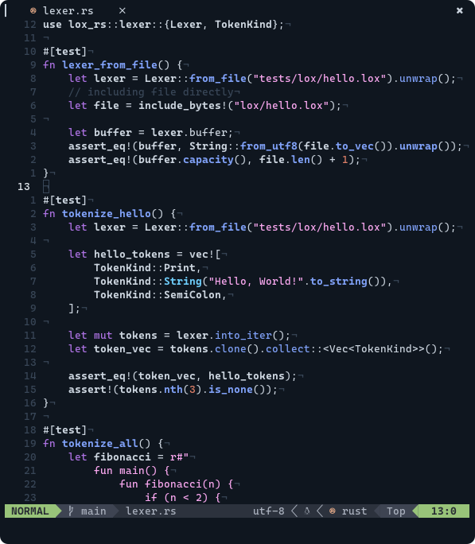

# Caerula

    

## Color scheme

### Background and Foreground

|           Color            | Palette    |                              Hex                              |
| :------------------------: | ---------- | :-----------------------------------------------------------: |
|  | Background | dim: `#0C1118` &nbsp; normal: `#0F161F` &nbsp; bright: `#0C1118` |
|  | Foreground | dim: `#384657` &nbsp; normal: `#CAD3DD` &nbsp; bright: `#E7EDF3` |

### Base Colors

|               Color               |  Palette   |    Hex    |
| :-------------------------------: | :--------: | :-------: |
|   | Dim green  | `#269273` |
|       |   Green    | `#82DFC4` |
|        |    Cyan    | `#6DCBF8` |
|        |    Blue    | `#7FA0F6` |
|      |   Purple   | `#AD72E3` |
|        |    Pink    | `#FAA8F0` |
|      |   Orange   | `#DF8068` |
|         |    Red     | `#D04E52` |
|     |  Dim red   | `#340E0F` |
|  | Dim Yellow | `#3A3009` |
|      |   Yellow   | `#E2C240` |
